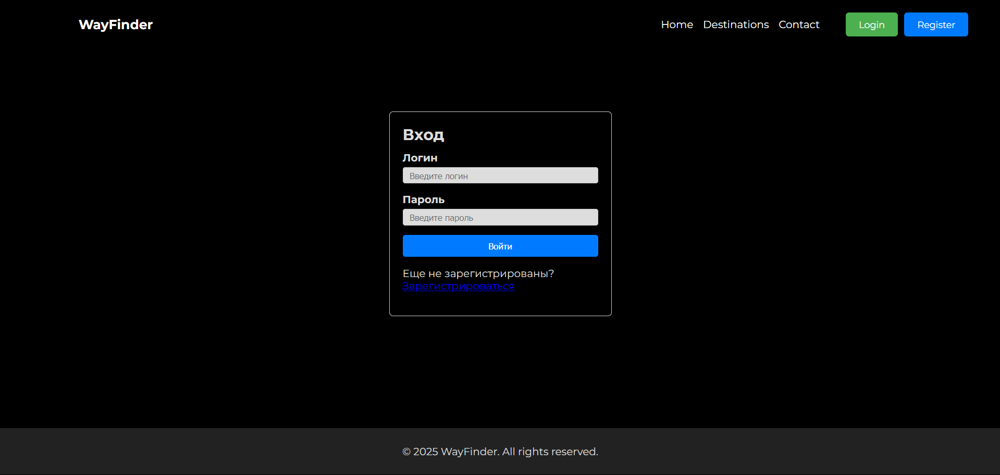
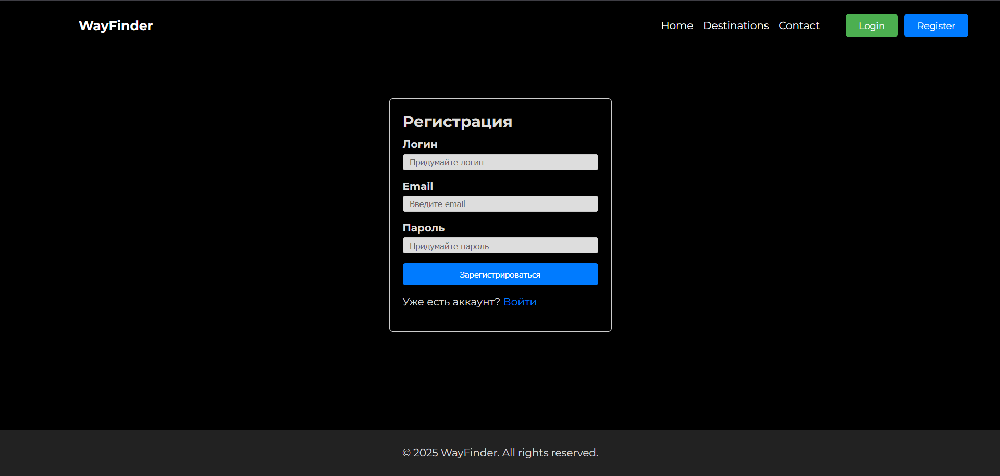
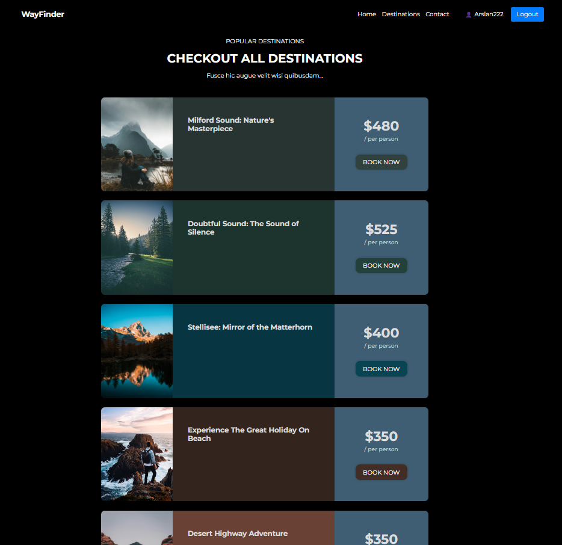
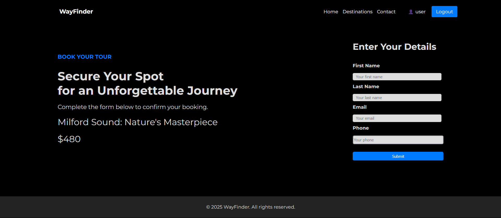
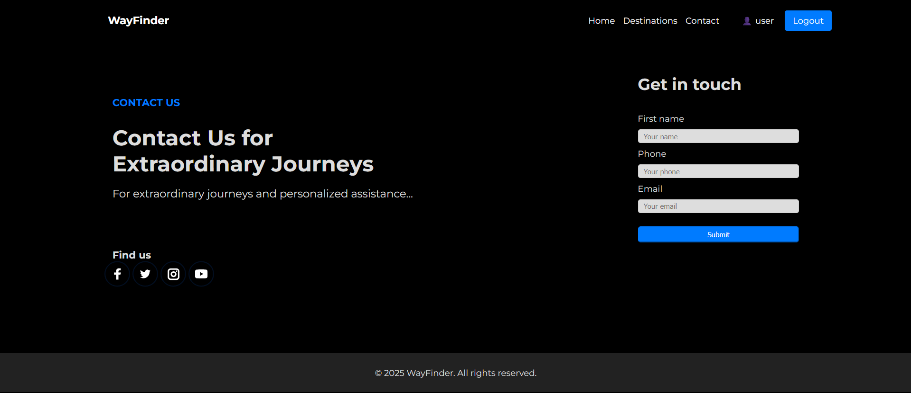

# WayFinder - Travel Booking Platform
WayFinder - это веб-приложение для бронирования туров с системой аутентификации пользователей, управлением контактами и бронированиями.

Особенности
- **Система аутентификации** - Регистрация и вход с хешированием паролей
- **Каталог туров** - Различные направления с ценами и описаниями
- **Бронирование туров** - Простая форма бронирования с валидацией
- **Контактная форма** - Сбор контактов с проверкой данных

## Технологии
### Backend
- **Flask** - Веб-фреймворк
- **SQLAlchemy** - ORM для работы с базой данных
- **SQLite** - База данных
- **bcrypt** - Хеширование паролей

### Frontend
- **HTML5/CSS3** - Разметка и стили
- **JavaScript** - Клиентская логика

## Демонстрация
### Главная страница 

### Вход / Регистрация

### Туры

### Букинг

### Обратная связь

